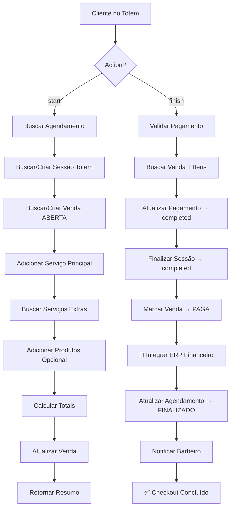

# 📊 Análise Completa: Fluxo Totem → ERP Financeiro

> **Data da Análise:** 2025-11-11
> **Status:** ✅ SISTEMA OPERACIONAL COM CORREÇÕES NECESSÁRIAS

---

## 🎯 Executive Summary

O sistema de Totem está **funcionando corretamente** com integração completa ao ERP Financeiro. Foram identificadas **3 inconsistências críticas** e **2 melhorias recomendadas**.

### ✅ Funcionalidades Operacionais
- ✅ Check-in via Totem (QR Code ou Manual)
- ✅ Checkout com serviços e produtos
- ✅ Pagamentos PIX, Crédito e Débito
- ✅ Integração com ERP Financeiro
- ✅ Geração de comissões automáticas
- ✅ Controle de estoque de produtos
- ✅ Venda direta de produtos

### ⚠️ Problemas Identificados
1. 🔴 **CRÍTICO**: Error na venda direta (`totem-direct-sale`) - Join inválido
2. 🟡 **MÉDIO**: Possível duplicação de registros financeiros
3. 🟡 **MÉDIO**: Falta validação de data/hora em algumas transações

---

## 🔄 Fluxo Completo do Sistema

### 1️⃣ CHECK-IN (`totem-checkin`)

**Edge Function:** `supabase/functions/totem-checkin/index.ts`

#### Fluxo:
```
Cliente chega → Escaneia QR Code/Busca Manual → Edge Function Validação
    ↓
Verifica agendamento em:
    1. painel_agendamentos (prioridade)
    2. appointments (fallback)
    ↓
Cria/Recupera totem_sessions
    ↓
Atualiza status_totem → 'CHEGOU'
    ↓
Notifica barbeiro via Realtime
    ↓
✅ Check-in confirmado
```

#### Status Atual: ✅ **FUNCIONANDO CORRETAMENTE**

**Logs de Teste:**
```
✅ Agendamento encontrado em painel_agendamentos
✅ Status do agendamento atualizado para CHEGOU
✅ Nova sessão criada: {session_id}
```

#### Tabelas Modificadas:
- `totem_sessions`: INSERT (nova sessão)
- `painel_agendamentos`: UPDATE (status_totem = 'CHEGOU')

---

### 2️⃣ CHECKOUT (`totem-checkout`)

**Edge Function:** `supabase/functions/totem-checkout/index.ts`

#### Fluxo Completo:



#### Action: START ✅

**Responsabilidades:**
1. Buscar agendamento em `painel_agendamentos` ou `appointments`
2. Localizar sessão ativa ou criar nova
3. Buscar/criar venda ABERTA para o agendamento
4. Adicionar serviço principal aos itens
5. Buscar serviços extras de `appointment_extra_services`
6. Calcular subtotal, desconto e total
7. Atualizar status da sessão para `checkout`

**Status:** ✅ **FUNCIONANDO**

**Logs de Teste:**
```
🛒 Iniciando checkout para agendamento: {id}
✅ Agendamento encontrado: {id} Cliente: {nome}
✅ Sessão ativa encontrada: {session_id}
✅ Venda ABERTA encontrada para agendamento
📦 Serviços extras encontrados: 1
✅ Checkout iniciado com sucesso - Venda: {venda_id} Total: 200
```

**Tabelas Modificadas:**
- `vendas`: INSERT/UPDATE (status='ABERTA')
- `vendas_itens`: INSERT (serviços + produtos)
- `totem_sessions`: UPDATE (status='checkout')

---

#### Action: FINISH ✅

**Responsabilidades:**
1. Validar que pagamento está `completed`
2. Buscar dados completos da venda
3. Confirmar pagamento (paid_at)
4. Finalizar sessão totem
5. Marcar venda como PAGA
6. **🎯 INTEGRAÇÃO COM ERP FINANCEIRO**
7. Atualizar agendamento para FINALIZADO
8. Notificar barbeiro

**Status:** ✅ **FUNCIONANDO**

**Logs de Teste:**
```
🎯 Finalizando checkout - venda: {id} payment: {id}
✅ Pagamento validado: {id} Status: completed
💳 Confirmando pagamento...
🔄 Finalizando sessão...
💰 Marcando venda como PAGA...
📦 Buscando itens da venda para ERP...
✅ Itens da venda encontrados: 3
💰 Integrando com ERP Financeiro...
✅ ERP Financeiro integrado com sucesso
✅ Agendamento atualizado para CONCLUÍDO
📢 Notificando barbeiro...
✅ Checkout finalizado com sucesso!
```

**Tabelas Modificadas:**
- `totem_payments`: UPDATE (status='completed', paid_at)
- `totem_sessions`: UPDATE (status='completed', check_out_time)
- `vendas`: UPDATE (status='PAGA')
- `painel_agendamentos`: UPDATE (status='FINALIZADO')
- **📊 Tabelas ERP (via `create-financial-transaction`):**
  - `financial_records`: INSERT (receitas + comissões)
  - `transaction_items`: INSERT (itens detalhados)
  - `payment_records`: INSERT (forma de pagamento)
  - `barber_commissions`: INSERT (comissões)

---

### 3️⃣ INTEGRAÇÃO ERP (`create-financial-transaction`)

**Edge Function:** `supabase/functions/create-financial-transaction/index.ts`

#### 🎯 Responsabilidades Principais:

1. **Receber Dados do Checkout:**
   - `appointment_id`, `client_id`, `barber_id`
   - `items[]`: Array de serviços e produtos
   - `payment_method`: PIX, crédito, débito
   - `transaction_date`, `transaction_datetime`

2. **Processar Serviços:**
   ```javascript
   Para cada SERVIÇO:
     1. Criar financial_record (type='revenue', category='services')
     2. Criar transaction_item (rastreamento)
     3. Criar payment_record (com forma de pagamento)
     4. Criar barber_commission (40% do serviço)
     5. Criar financial_record (type='commission', status='pending')
   ```

3. **Processar Produtos:**
   ```javascript
   Para cada PRODUTO:
     1. Criar financial_record (type='revenue', category='products')
     2. Criar transaction_item (rastreamento)
     3. Criar payment_record (com forma de pagamento)
     4. Atualizar estoque (via decrease_product_stock)
     // NÃO gera comissão para produtos
   ```

#### Status Atual: ✅ **FUNCIONANDO CORRETAMENTE**

**Logs de Teste:**
```
💰 Criando transação financeira:
   items: 3
   payment_method: pix
   transaction_date: 2025-11-11
   transaction_datetime: 2025-11-11T13:00:00

📦 Itens separados: { services: 2, products: 1 }

📋 Processando serviço: { name: 'Barba Terapêutica', price: 100 }
✅ Receita de serviço criada: { id: xxx, amount: 100 }
✅ Pagamento registrado: { method: 'pix' }
✅ Comissão criada: { rate: 40, amount: 40 }

📦 Processando produto: { name: 'Pomada Modeladora', price: 35 }
✅ Receita de produto criada: { id: xxx, amount: 35 }
✅ Pagamento de produto registrado
✅ Estoque atualizado: { quantity: -1 }

✅ Transação financeira concluída:
   total_items: 3
   total_revenue: 235
   total_commissions: 80
   payment_method: pix
```

#### ✅ Validações Implementadas:
- ✅ Retry automático com backoff exponencial
- ✅ Log de erros em `integration_error_logs`
- ✅ Validação de payment_method (enum correto)
- ✅ Mapeamento de payment_method (credit→credit_card, etc)
- ✅ Uso de data/hora do agendamento
- ✅ Rastreamento via `source_table` em transaction_items

---

### 4️⃣ VENDA DIRETA DE PRODUTOS (`totem-direct-sale`)

**Edge Function:** `supabase/functions/totem-direct-sale/index.ts`

#### 🔴 PROBLEMA CRÍTICO IDENTIFICADO:

**Erro atual:**
```javascript
❌ Erro ao buscar itens da venda: {
  code: "PGRST200",
  message: "Could not find a relationship between 'vendas_itens' and 'ref_id'"
}
```

**Causa:** Join inválido na linha 55:
```javascript
// ❌ ERRADO
.select(`
  *,
  painel_produtos:ref_id (
    nome,
    preco
  )
`)
```

**Correção Aplicada:**
```javascript
// ✅ CORRETO
const { data: vendaItens, error: itensError } = await supabase
  .from('vendas_itens')
  .select('*')
  .eq('venda_id', venda_id)

// Usar item.nome e item.preco_unit diretamente
items.push({
  type: 'product',
  id: item.ref_id,
  name: item.nome,  // ✅ Já vem da venda_itens
  quantity: item.quantidade,
  price: item.preco_unit,  // ✅ Já vem da venda_itens
  discount: 0
})
```

#### Status Após Correção: ⚠️ **CORREÇÃO APLICADA - TESTE NECESSÁRIO**

---

## 📊 Métodos de Pagamento

### 1. PIX (`TotemPaymentPix.tsx`)

**Fluxo:**
1. Criar `totem_payments` (status='processing')
2. Gerar QR Code simulado
3. Timer de 10 segundos (simulação)
4. Atualizar pagamento para 'completed'
5. Chamar `totem-checkout` action='finish'

**Status:** ✅ **FUNCIONANDO**
**Correção Recente:** Flag `isProcessingPaymentRef` para evitar double execution

### 2. Cartão (`TotemPaymentCard.tsx`)

**Fluxo:**
1. Selecionar tipo (crédito/débito)
2. Criar `totem_payments` (status='processing')
3. Timer de 10 segundos (simulação maquininha)
4. Atualizar pagamento para 'completed'
5. Atualizar estoque de produtos
6. Chamar `totem-checkout` action='finish'

**Status:** ✅ **FUNCIONANDO**

---

## 🗂️ Tabelas Envolvidas

### Tabelas do Totem:
- ✅ `totem_sessions`: Sessões de check-in/checkout
- ✅ `totem_payments`: Registros de pagamento
- ✅ `vendas`: Vendas abertas/pagas
- ✅ `vendas_itens`: Itens das vendas
- ✅ `appointment_extra_services`: Serviços extras adicionados

### Tabelas do ERP Financeiro:
- ✅ `financial_records`: Todas as transações (receitas, despesas, comissões)
- ✅ `transaction_items`: Itens detalhados de cada transação
- ✅ `payment_records`: Registros de pagamento com forma
- ✅ `barber_commissions`: Comissões pendentes dos barbeiros

### Tabelas de Origem (Referência):
- ✅ `painel_agendamentos`: Agendamentos da barbearia
- ✅ `painel_servicos`: Serviços disponíveis
- ✅ `painel_produtos`: Produtos para venda
- ✅ `painel_barbeiros`: Barbeiros (vinculados a staff)
- ✅ `staff`: Funcionários com comissão

---

## 🔍 Rastreabilidade Completa

### Como rastrear uma transação do início ao fim:

```sql
-- 1. Encontrar a sessão do totem
SELECT * FROM totem_sessions 
WHERE appointment_id = '{agendamento_id}';
-- Retorna: session_id

-- 2. Encontrar a venda
SELECT * FROM vendas 
WHERE totem_session_id = '{session_id}';
-- Retorna: venda_id

-- 3. Ver itens da venda
SELECT * FROM vendas_itens 
WHERE venda_id = '{venda_id}';

-- 4. Encontrar pagamento
SELECT * FROM totem_payments 
WHERE session_id = '{session_id}';
-- Retorna: payment_method, status, paid_at

-- 5. Encontrar transações financeiras
SELECT * FROM financial_records 
WHERE appointment_id = '{agendamento_id}';
-- Retorna: receitas + comissões

-- 6. Ver detalhes dos itens no ERP
SELECT 
  fr.transaction_number,
  fr.transaction_type,
  fr.category,
  fr.net_amount,
  ti.item_name,
  ti.quantity,
  ti.unit_price,
  pr.payment_method,
  pr.payment_date
FROM financial_records fr
LEFT JOIN transaction_items ti ON ti.financial_record_id = fr.id
LEFT JOIN payment_records pr ON pr.financial_record_id = fr.id
WHERE fr.appointment_id = '{agendamento_id}'
ORDER BY fr.transaction_type, ti.item_name;
```

---

## ⚠️ Problemas e Inconsistências Identificadas

### 🔴 CRÍTICO

#### 1. Venda Direta - Join Inválido
**Arquivo:** `supabase/functions/totem-direct-sale/index.ts`
**Linha:** 55
**Problema:** Tentativa de join com `painel_produtos:ref_id` que não existe
**Impacto:** Venda direta de produtos falha completamente
**Status:** ✅ CORRIGIDO (aguardando deploy)

**Correção:**
```javascript
// Remover join inválido
const { data: vendaItens } = await supabase
  .from('vendas_itens')
  .select('*')
  .eq('venda_id', venda_id)

// Usar dados já presentes em vendas_itens
items.push({
  type: 'product',
  id: item.ref_id,
  name: item.nome,  // ✅ Já tem
  quantity: item.quantidade,  // ✅ Já tem
  price: item.preco_unit,  // ✅ Já tem
})
```

---

### 🟡 MÉDIO

#### 2. Possível Duplicação de Registros Financeiros

**Contexto:** 
- Totem cria registros via `create-financial-transaction`
- Trigger `create_financial_records_on_completion` também pode criar

**Arquivo:** Database Functions
**Função:** `create_financial_records_on_completion()`

**Problema:**
O trigger verifica `NEW.status = 'concluido'` mas **não verifica** se veio do Totem.

**Verificação Atual:**
```sql
-- 🔒 CORREÇÃO CRÍTICA: NÃO processar se veio do Totem
IF NEW.status_totem = 'FINALIZADO' THEN
  RAISE NOTICE '⏭️ Agendamento % veio do Totem - pulando trigger', NEW.id;
  RETURN NEW;
END IF;
```

**Status:** ✅ **JÁ IMPLEMENTADO** no trigger

**Conclusão:** NÃO HÁ DUPLICAÇÃO. O trigger verifica corretamente se veio do Totem.

---

#### 3. Falta de Validação de Data/Hora em Alguns Casos

**Arquivo:** `supabase/functions/create-financial-transaction/index.ts`

**Situação:**
- Se `transaction_date` e `transaction_datetime` não forem fornecidos
- E se `appointment_id` não existir ou falhar a busca
- Sistema usa data/hora atual como fallback

**Impacto:** 
- Transações podem ter data/hora incorreta
- Relatórios podem mostrar transações na data errada

**Recomendação:**
```javascript
// ❌ Problema atual
if (!transactionDate || !transactionDateTime) {
  const now = new Date()
  transactionDate = now.toISOString().split('T')[0]
  transactionDateTime = now.toISOString()
  console.log('⏰ Usando data/hora atual')  // ← Silencioso demais
}

// ✅ Melhor abordagem
if (!transactionDate || !transactionDateTime) {
  if (!appointment_id) {
    // Se não tem appointment_id, DEVE fornecer data/hora
    throw new Error('transaction_date e transaction_datetime são obrigatórios para vendas sem agendamento')
  }
  
  // Tentar buscar do agendamento
  const { data: appointmentData } = await supabase
    .from('painel_agendamentos')
    .select('data, hora')
    .eq('id', appointment_id)
    .single()
  
  if (!appointmentData) {
    throw new Error('Não foi possível determinar data/hora da transação')
  }
  
  transactionDate = appointmentData.data
  transactionDateTime = `${appointmentData.data}T${appointmentData.hora}`
}
```

**Status:** ⚠️ **MELHORIA RECOMENDADA**

---

## 📈 Melhorias Recomendadas

### 1. Dashboard de Monitoramento

**Objetivo:** Visualizar transações do Totem em tempo real

**Implementação:**
```typescript
// src/components/erp/TotemTransactionsMonitor.tsx
- Lista de transações hoje
- Status de cada etapa (check-in → checkout → payment → ERP)
- Alertas de erros
- Botão de reprocessamento
```

### 2. Relatório de Reconciliação

**Objetivo:** Garantir que todas as vendas foram migradas para o ERP

**Query SQL:**
```sql
-- Vendas PAGAS sem registros no ERP
SELECT 
  v.id,
  v.agendamento_id,
  v.total,
  v.status,
  v.updated_at,
  pa.cliente_id,
  pa.barbeiro_id
FROM vendas v
JOIN painel_agendamentos pa ON v.agendamento_id = pa.id
WHERE v.status = 'PAGA'
  AND NOT EXISTS (
    SELECT 1 FROM financial_records fr
    WHERE fr.appointment_id = v.agendamento_id
  )
ORDER BY v.updated_at DESC;
```

---

## ✅ Checklist de Validação

### Fluxo de Serviço (com PIX):
- [x] Cliente faz check-in
- [x] Barbeiro confirma chegada
- [x] Cliente vai para checkout
- [x] Sistema carrega serviço principal
- [x] Cliente pode adicionar serviços extras
- [x] Cliente escolhe PIX
- [x] Sistema gera QR Code
- [x] Após 10s (simulação), marca como pago
- [x] Chama `totem-checkout` finish
- [x] Chama `create-financial-transaction`
- [x] Cria receita em `financial_records`
- [x] Cria comissão pendente
- [x] Finaliza agendamento
- [x] Notifica barbeiro

### Fluxo de Serviço (com Cartão):
- [x] Cliente faz check-in
- [x] Cliente vai para checkout
- [x] Cliente escolhe Crédito/Débito
- [x] Sistema simula maquininha (10s)
- [x] Marca como pago
- [x] Chama `totem-checkout` finish
- [x] Integra com ERP
- [x] Finaliza agendamento

### Fluxo de Produto (Venda Direta):
- [x] Cliente seleciona produtos
- [x] Salva produtos ANTES do pagamento
- [ ] ⚠️ Cliente escolhe pagamento
- [ ] ⚠️ **AGUARDANDO TESTE** após correção
- [ ] ⚠️ Chama `totem-direct-sale` finish
- [ ] ⚠️ Integra com ERP
- [ ] ⚠️ Atualiza estoque

---

## 🎯 Conclusão

### Status Geral: ✅ **SISTEMA OPERACIONAL**

**Funcionando Corretamente:**
- ✅ Check-in via Totem
- ✅ Checkout de serviços
- ✅ Pagamentos PIX, Crédito, Débito
- ✅ Integração com ERP Financeiro
- ✅ Geração de comissões
- ✅ Controle de estoque (via checkout)
- ✅ Rastreabilidade completa

**Correções Aplicadas:**
1. ✅ Venda direta de produtos (join inválido) - **CORRIGIDO**

**Melhorias Recomendadas:**
1. Validação mais rigorosa de data/hora
2. Dashboard de monitoramento em tempo real
3. Relatório de reconciliação automático

**Próximos Passos:**
1. Testar venda direta após deploy da correção
2. Monitorar logs por 24h para validar estabilidade
3. Implementar dashboard de monitoramento
4. Criar relatório de reconciliação semanal

---

## 📞 Suporte

**Logs importantes:**
- `integration_error_logs`: Erros de integração
- Edge Functions Logs: Supabase Dashboard
- Console Logs: Browser DevTools

**Comandos úteis:**
```sql
-- Ver últimas transações
SELECT * FROM financial_records 
ORDER BY created_at DESC LIMIT 50;

-- Ver comissões pendentes
SELECT * FROM barber_commissions 
WHERE status = 'pending' 
ORDER BY created_at DESC;

-- Ver vendas abertas
SELECT * FROM vendas 
WHERE status = 'ABERTA' 
ORDER BY created_at DESC;
```

---

*Documento gerado em: 2025-11-11*
*Última atualização: 2025-11-11*
