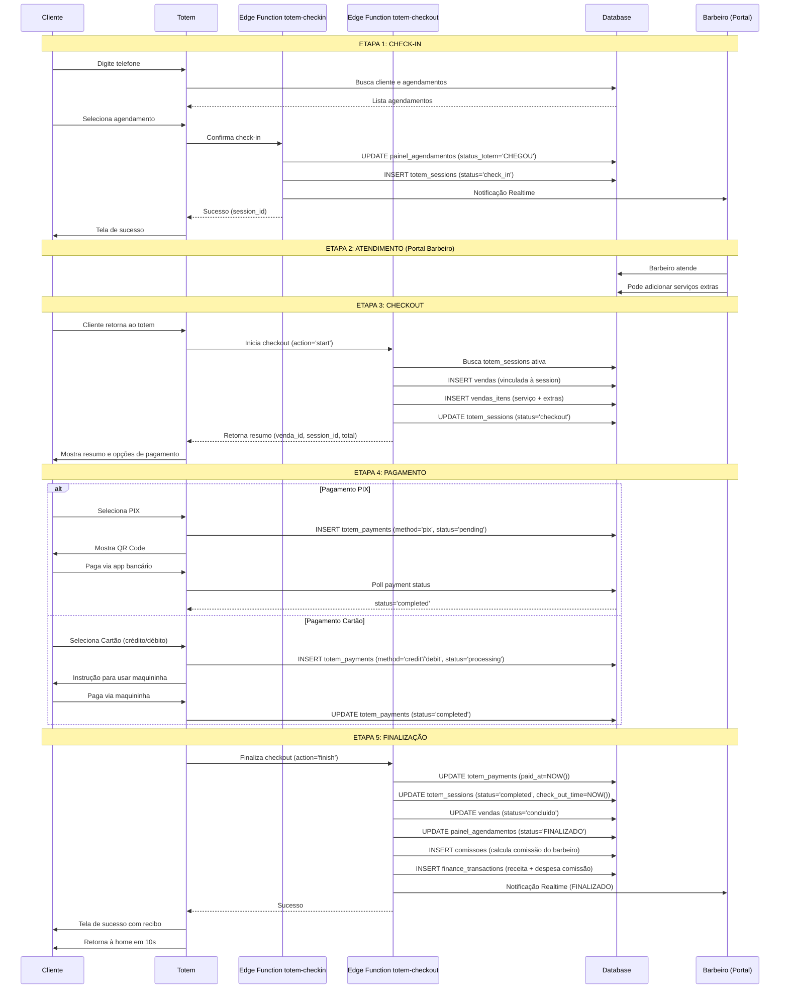

# 📋 ANÁLISE COMPLETA - Implementação do Fluxo de Totem

## 🎯 STATUS ATUAL

### ✅ JÁ IMPLEMENTADO:
1. **Tela de Login** (`TotemLogin.tsx`) - Autenticação por PIN
2. **Tela Home** (`TotemHome.tsx`) - Botões de Check-in e Check-out
3. **Busca por Telefone** (`TotemSearch.tsx`) - Busca cliente
4. **Lista de Agendamentos** (`TotemAppointmentsList.tsx`) - Seleção do agendamento
5. **Confirmação de Check-in** (`TotemConfirmation.tsx`) - Confirma dados antes do check-in
6. **Sucesso Check-in** (`TotemCheckInSuccess.tsx`) - Feedback visual
7. **Edge Function Check-in** (`totem-checkin`) - Backend funcionando
8. **Edge Function Checkout** (`totem-checkout`) - Backend funcionando
9. **Telas de Checkout/Pagamento** - JÁ CRIADAS mas com problemas

### ⚠️ PROBLEMAS IDENTIFICADOS:

#### 1. **Inconsistência de Dados entre Telas**
- `TotemCheckout` passa `venda_id` 
- `TotemPaymentPix` e `TotemPaymentCard` esperam `sessionId`
- Não há criação de sessão totem antes do checkout

#### 2. **Falta de Integração Completa**
- Check-in não cria sessão totem
- Checkout não conecta com sessão existente
- Pagamento não finaliza corretamente a venda

#### 3. **Fluxo do Totem Sessions**
Atualmente:
- Check-in → Atualiza apenas `painel_agendamentos.status_totem = 'CHEGOU'`
- Não cria `totem_sessions`

Deveria ser:
- Check-in → Atualiza agendamento + Cria `totem_sessions`
- Checkout → Usa sessão existente + Cria venda
- Pagamento → Atualiza sessão + Finaliza venda

#### 4. **Edge Function `totem-checkout` Incompleta**
- Cria venda mas não atualiza sessão
- Não trata corretamente o fluxo de finalização
- Falta integração com comissões

---

## 🔧 SOLUÇÕES NECESSÁRIAS

### SOLUÇÃO 1: Corrigir Edge Function `totem-checkin`
```typescript
// Deve criar totem_sessions ao fazer check-in
INSERT INTO totem_sessions (
  appointment_id,
  status,
  check_in_time
) VALUES (
  agendamento_id,
  'check_in',
  NOW()
)
```

### SOLUÇÃO 2: Corrigir Edge Function `totem-checkout`
```typescript
// action: 'start'
1. Buscar sessão ativa do agendamento
2. Criar venda vinculada à sessão
3. Adicionar itens à venda
4. Retornar venda_id e session_id

// action: 'finish'
1. Atualizar totem_payments.status = 'completed'
2. Atualizar totem_sessions.status = 'completed'
3. Atualizar vendas.status = 'concluido'
4. Atualizar painel_agendamentos.status = 'FINALIZADO'
5. Gerar comissão
6. Criar transações financeiras
7. Notificar barbeiro via Realtime
```

### SOLUÇÃO 3: Corrigir Fluxo das Telas Frontend

#### TotemCheckout.tsx
✅ Já busca dados corretamente
❌ Precisa passar `session_id` junto com `venda_id`

#### TotemPaymentPix.tsx e TotemPaymentCard.tsx
❌ Recebem `sessionId` mas deveria ser `session_id` e `venda_id`
❌ Atualizam apenas `totem_sessions` mas não finalizam a venda corretamente

#### TotemPaymentSuccess.tsx
✅ Exibe recibo corretamente
❌ Não chama edge function para finalizar (gerar comissão, etc)

---

## 📊 FLUXO COMPLETO CORRETO



---

## 🚀 IMPLEMENTAÇÕES NECESSÁRIAS

### 1. Atualizar `totem-checkin` Edge Function ✅ (Já está OK, só precisa criar sessão)

### 2. Refatorar `totem-checkout` Edge Function ⚠️ (CRÍTICO)
- Adicionar lógica para `action: 'finish'`
- Gerar comissões
- Criar transações financeiras
- Notificar via Realtime

### 3. Corrigir TotemCheckout.tsx ⚠️
- Garantir que passa `session_id` e `venda_id`

### 4. Corrigir TotemPaymentPix.tsx e TotemPaymentCard.tsx ⚠️
- Receber `session_id` e `venda_id`
- Após pagamento confirmado, chamar `totem-checkout` com `action: 'finish'`

### 5. Atualizar TotemPaymentSuccess.tsx ✅ (Já está OK)

---

## 📝 TABELAS ENVOLVIDAS

### `totem_sessions`
```sql
CREATE TABLE totem_sessions (
  id UUID PRIMARY KEY,
  appointment_id UUID REFERENCES painel_agendamentos(id),
  status TEXT, -- 'check_in', 'in_service', 'checkout', 'payment', 'completed'
  check_in_time TIMESTAMP,
  check_out_time TIMESTAMP,
  created_at TIMESTAMP
)
```

### `vendas`
```sql
CREATE TABLE vendas (
  id UUID PRIMARY KEY,
  cliente_id UUID,
  barbeiro_id UUID,
  data_venda TIMESTAMP,
  subtotal NUMERIC,
  desconto NUMERIC,
  total NUMERIC,
  status TEXT, -- 'pendente', 'concluido', 'cancelado'
  created_at TIMESTAMP
)
```

### `vendas_itens`
```sql
CREATE TABLE vendas_itens (
  id UUID PRIMARY KEY,
  venda_id UUID REFERENCES vendas(id),
  tipo TEXT, -- 'servico' ou 'produto'
  item_id UUID,
  quantidade INTEGER,
  preco_unitario NUMERIC,
  subtotal NUMERIC
)
```

### `totem_payments`
```sql
CREATE TABLE totem_payments (
  id UUID PRIMARY KEY,
  session_id UUID REFERENCES totem_sessions(id),
  payment_method TEXT, -- 'pix', 'credit', 'debit'
  amount NUMERIC,
  status TEXT, -- 'pending', 'processing', 'completed', 'failed'
  pix_qr_code TEXT,
  transaction_id TEXT,
  paid_at TIMESTAMP,
  created_at TIMESTAMP
)
```

### `comissoes`
```sql
CREATE TABLE comissoes (
  id UUID PRIMARY KEY,
  barbeiro_id UUID,
  agendamento_id UUID,
  valor NUMERIC,
  percentual NUMERIC,
  data DATE,
  status TEXT -- 'gerado', 'pago'
)
```

---

## ✅ CHECKLIST DE IMPLEMENTAÇÃO

- [ ] 1. Atualizar `totem-checkin` para criar `totem_sessions`
- [ ] 2. Refatorar completamente `totem-checkout` com `action: 'finish'`
- [ ] 3. Corrigir `TotemCheckout.tsx` para passar dados corretos
- [ ] 4. Corrigir `TotemPaymentPix.tsx` para finalizar venda
- [ ] 5. Corrigir `TotemPaymentCard.tsx` para finalizar venda
- [ ] 6. Testar fluxo completo de ponta a ponta
- [ ] 7. Adicionar tratamento de erros robusto
- [ ] 8. Adicionar logs para debugging
- [ ] 9. Documentar configurações necessárias (chave PIX, etc)

---

**Costa Urbana - Sistema de Totem Completo** ✨
