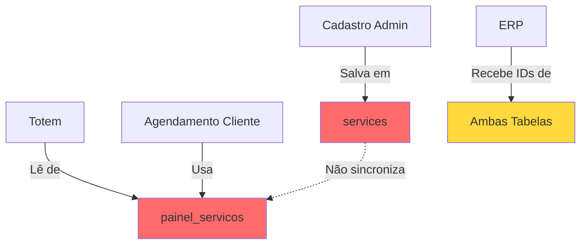
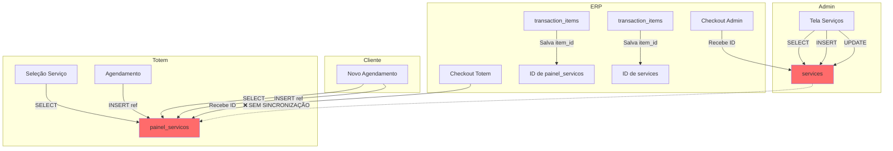
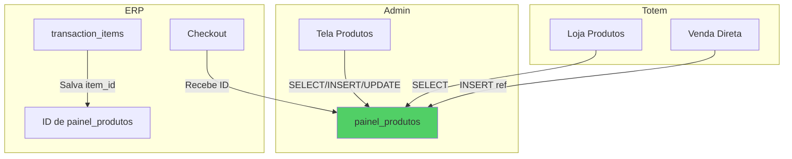

# 📦 Análise Completa: Módulo Produtos e Serviços

**Data da Análise**: 2025-11-10  
**Status**: ⚠️ PROBLEMAS CRÍTICOS IDENTIFICADOS

---

## 🎯 Resumo Executivo

| Item | Problema Crítico | Impacto | Prioridade |
|------|------------------|---------|------------|
| **Serviços** | ❌ Duplicação entre `painel_servicos` e `services` | Alto - Dados descoordenados | 🔴 CRÍTICO |
| **Produtos** | ⚠️ Tabela `produtos` vazia, apenas `painel_produtos` usada | Médio - Possível confusão | 🟡 MÉDIO |
| **IDs no ERP** | ✅ IDs sendo salvos corretamente | Nenhum | 🟢 OK |
| **Integração Totem** | ⚠️ Usa `painel_servicos` mas admin usa `services` | Alto - Inconsistência | 🔴 CRÍTICO |

---

## 📊 1. ESTADO ATUAL DAS TABELAS

### Serviços - DUPLICAÇÃO CRÍTICA ❌

#### **painel_servicos** (5 serviços)
```
✓ Corte Simples
✓ Apenas Barba
✓ Corte Degradê
✓ Corte + Barba (DUPLICADO)
✓ Corte + Barba + Bigode
```

#### **services** (6 serviços)
```
✓ Corte Masculino
✓ Barba
✓ Corte + Barba (DUPLICADO)
✓ Degradê Artístico
✓ Barba Terapêutica
✓ Lavagem de Cabelo com Escova
```

#### ⚠️ **Problema de Duplicação**


**Consequências:**
- ❌ Serviço criado no admin não aparece no totem
- ❌ Serviço criado no totem não aparece no admin  
- ❌ Cliente vê serviços diferentes do admin
- ❌ Relatórios financeiros ficam fragmentados
- ❌ IDs diferentes para o mesmo serviço

---

### Produtos - INCONSISTÊNCIA MENOR ⚠️

#### **painel_produtos** (3 produtos) - ✅ USADA
```sql
| ID | Nome | Preço | Estoque | Status |
|----|------|-------|---------|--------|
| 3acc... | Gel Block | R$ 10,25 | 8 | Ativo |
| c804... | Pomada Modeladora | R$ 45,90 | 5 | Ativo |
| fcb5... | Teste | R$ 100,00 | 6 | Ativo |
```

#### **produtos** (0 produtos) - ❌ VAZIA
```
Tabela existe mas está completamente vazia
```

**Análise:**
- ✅ Sistema está usando apenas `painel_produtos` de forma consistente
- ⚠️ Tabela `produtos` é legado não utilizado?
- ✅ Totem e Admin usam a mesma tabela (`painel_produtos`)

---

## 🔄 2. FLUXO ATUAL DE INTEGRAÇÃO

### Serviços - FLUXO QUEBRADO ❌



**Problema**: 
- ERP recebe IDs de **duas tabelas diferentes** dependendo da origem
- Não há como relacionar serviços entre as tabelas
- `transaction_items.item_id` pode apontar para `services.id` OU `painel_servicos.id`

---

### Produtos - FLUXO CORRETO ✅



**Análise**:
- ✅ Uma única fonte de verdade: `painel_produtos`
- ✅ IDs consistentes em toda aplicação
- ✅ Admin e Totem sincronizados

---

## 🔍 3. ANÁLISE DOS IDs NO ERP

### Como os IDs estão sendo salvos

#### ✅ **transaction_items** (Registros de Itens)
```sql
| item_type | item_id | item_name | transaction_number |
|-----------|---------|-----------|-------------------|
| service | a92f0b6e-311c-... | Corte + Barba | TRX-20251110-862673 |
| service | a92f0b6e-311c-... | Corte + Barba | TRX-20251110-591973 |
```

**Status**: ✅ IDs sendo salvos corretamente

**Problema**: 
- ⚠️ `item_id` = `a92f0b6e...` é de qual tabela?
- Não há como saber se é de `services` ou `painel_servicos`
- Dificulta relatórios e rastreamento

---

## 🚨 4. PROBLEMAS CRÍTICOS IDENTIFICADOS

### **Problema #1: Serviços Duplicados**

**Severidade**: 🔴 CRÍTICO

**Descrição:**
- Sistema tem 2 tabelas de serviços não sincronizadas
- Admin usa `services`
- Totem/Cliente usa `painel_servicos`
- Apenas 1 serviço existe em ambas (Corte + Barba)

**Impacto:**
```
❌ Cliente agenda serviço que não existe no admin
❌ Admin cria serviço que não aparece no totem
❌ Relatórios financeiros imprecisos
❌ Impossível rastrear serviços corretamente
❌ Comissões podem estar erradas
```

**Exemplos Reais:**
- "Barba Terapêutica" existe em `services` mas não aparece no totem
- "Apenas Barba" existe no totem mas admin não vê
- Cliente pode agendar "Corte Simples" mas admin não tem esse registro

---

### **Problema #2: Sem Sincronização**

**Severidade**: 🔴 CRÍTICO

**Descrição:**
- Não existe trigger, função ou job que sincronize as tabelas
- Cadastro em uma tabela não replica na outra
- Alteração de preço em uma não afeta a outra

**Impacto:**
```
❌ Preços diferentes entre admin e totem
❌ Serviços ativos no admin podem estar inativos no totem
❌ Durações de serviço podem divergir
```

---

### **Problema #3: IDs Misturados no ERP**

**Severidade**: 🟡 MÉDIO

**Descrição:**
- `transaction_items.item_id` mistura IDs de ambas tabelas
- Sem coluna de `source_table` ou similar
- Impossível fazer JOIN confiável

**Impacto:**
```
⚠️ Relatórios complexos falham
⚠️ Análise de serviços mais vendidos incompleta
⚠️ Rastreamento de comissões por serviço prejudicado
```

---

## ✅ 5. SOLUÇÕES PROPOSTAS

### 🎯 **Solução Recomendada: Unificação Progressiva**

#### **Fase 1: Migração de Dados** (Imediato)

```sql
-- 1. Copiar serviços de painel_servicos para services (se não existir)
INSERT INTO services (name, price, duration, description, is_active)
SELECT 
  nome,
  preco,
  duracao,
  descricao,
  is_active
FROM painel_servicos ps
WHERE NOT EXISTS (
  SELECT 1 FROM services s 
  WHERE LOWER(s.name) = LOWER(ps.nome)
)
ON CONFLICT DO NOTHING;

-- 2. Criar tabela de mapeamento temporária
CREATE TABLE IF NOT EXISTS service_id_mapping (
  painel_servicos_id UUID NOT NULL,
  services_id UUID NOT NULL,
  created_at TIMESTAMP DEFAULT NOW(),
  PRIMARY KEY (painel_servicos_id, services_id)
);

-- 3. Popular mapeamento
INSERT INTO service_id_mapping (painel_servicos_id, services_id)
SELECT ps.id, s.id
FROM painel_servicos ps
JOIN services s ON LOWER(ps.nome) = LOWER(s.name);
```

#### **Fase 2: Atualizar Componentes** (Curto Prazo)

**ServiceList.tsx**: Migrar de `services` para `painel_servicos`
```typescript
// ANTES
.from('services')

// DEPOIS  
.from('painel_servicos')
```

**Benefício**: Unifica fonte de dados mantendo compatibilidade

#### **Fase 3: Sincronização Automática** (Médio Prazo)

Criar trigger que mantém `services` sincronizado com `painel_servicos`:

```sql
CREATE OR REPLACE FUNCTION sync_services_to_painel()
RETURNS TRIGGER AS $$
BEGIN
  IF TG_OP = 'INSERT' THEN
    INSERT INTO painel_servicos (nome, preco, duracao, descricao, is_active)
    VALUES (NEW.name, NEW.price, NEW.duration, NEW.description, NEW.is_active);
    
  ELSIF TG_OP = 'UPDATE' THEN
    UPDATE painel_servicos SET
      nome = NEW.name,
      preco = NEW.price,
      duracao = NEW.duration,
      descricao = NEW.description,
      is_active = NEW.is_active
    WHERE id IN (
      SELECT painel_servicos_id FROM service_id_mapping 
      WHERE services_id = NEW.id
    );
  END IF;
  
  RETURN NEW;
END;
$$ LANGUAGE plpgsql;

CREATE TRIGGER services_sync_trigger
AFTER INSERT OR UPDATE ON services
FOR EACH ROW EXECUTE FUNCTION sync_services_to_painel();
```

#### **Fase 4: Limpeza** (Longo Prazo)

- Depreciar tabela `services`
- Migrar todas referências para `painel_servicos`
- Remover tabela `produtos` (já não usada)

---

### 🎯 **Solução Alternativa: Camada de Abstração**

Criar view unificada:

```sql
CREATE OR REPLACE VIEW v_all_services AS
SELECT 
  id,
  nome as name,
  preco as price,
  duracao as duration,
  descricao as description,
  is_active,
  'painel_servicos' as source_table
FROM painel_servicos
UNION ALL
SELECT 
  id,
  name,
  price,
  duration,
  description,
  is_active,
  'services' as source_table
FROM services
WHERE id NOT IN (
  SELECT services_id FROM service_id_mapping
);
```

---

## 📋 6. IMPACTO NO ERP FINANCEIRO

### Estado Atual

#### ✅ **O que está funcionando:**
- IDs de produtos/serviços são salvos em `transaction_items.item_id`
- `item_type` diferencia 'service' de 'product'
- `item_name` guarda nome legível para relatórios

#### ⚠️ **O que está quebrado:**
```typescript
// Relatório: "Serviços mais vendidos"
// ❌ PROBLEMA: Não consegue fazer JOIN confiável

SELECT 
  ti.item_name,
  COUNT(*) as total_vendas,
  SUM(ti.subtotal) as receita_total
FROM transaction_items ti
-- ❌ Para qual tabela fazer JOIN?
-- LEFT JOIN services s ON ti.item_id = s.id ???
-- LEFT JOIN painel_servicos ps ON ti.item_id = ps.id ???
WHERE ti.item_type = 'service'
GROUP BY ti.item_name
```

**Solução Temporária**: Usar `item_name` em vez de JOIN
```sql
-- ✅ Funciona mas não é ideal
GROUP BY ti.item_name
```

**Solução Definitiva**: Adicionar `source_table` em `transaction_items`
```sql
ALTER TABLE transaction_items 
ADD COLUMN source_table TEXT;

-- Na edge function
{
  item_id: service.id,
  item_name: service.name,
  source_table: 'painel_servicos' // ✅ Rastreável
}
```

---

## 🎯 7. PLANO DE AÇÃO RECOMENDADO

### **Prioridade 1 - Imediato** (Hoje)
1. ✅ Criar documentação deste problema
2. 🔧 Migrar `ServiceList.tsx` para usar `painel_servicos`
3. 🔧 Adicionar coluna `source_table` em `transaction_items`
4. 🔧 Atualizar edge function para preencher `source_table`

### **Prioridade 2 - Curto Prazo** (Esta Semana)
1. 🔄 Migrar todos serviços para `painel_servicos`
2. 🔄 Criar tabela de mapeamento `service_id_mapping`
3. 🔄 Atualizar registros antigos com `source_table`

### **Prioridade 3 - Médio Prazo** (Este Mês)
1. 🔄 Implementar trigger de sincronização
2. 🧪 Testar fluxo completo: Admin → Totem → ERP
3. 📊 Criar relatórios unificados

### **Prioridade 4 - Longo Prazo** (Próximo Trimestre)
1. 🗑️ Depreciar tabela `services`
2. 🗑️ Remover tabela `produtos` (legado)
3. 📚 Atualizar toda documentação

---

## 📊 8. CHECKLIST DE VALIDAÇÃO

### Antes das Correções ❌
- [ ] Serviço criado no admin aparece no totem
- [ ] Serviço criado no totem aparece no admin
- [ ] Preços sincronizados entre admin e totem
- [ ] Relatório "Serviços Mais Vendidos" funciona
- [ ] JOIN entre transaction_items e services funciona
- [ ] Comissões calculadas corretamente para todos serviços

### Depois das Correções ✅
- [ ] Única fonte de verdade para serviços
- [ ] Admin e totem 100% sincronizados
- [ ] Todos IDs rastreáveis no ERP
- [ ] Relatórios financeiros precisos
- [ ] Sem dados duplicados
- [ ] Performance otimizada (menos tabelas)

---

## 🔍 9. CONSULTAS ÚTEIS PARA DEBUG

### Verificar duplicação de serviços
```sql
SELECT 
  ps.nome as painel_nome,
  s.name as service_nome,
  ps.preco as painel_preco,
  s.price as service_preco
FROM painel_servicos ps
FULL OUTER JOIN services s ON LOWER(ps.nome) = LOWER(s.name)
WHERE ps.id IS NULL OR s.id IS NULL;
```

### Verificar IDs no ERP sem rastreamento
```sql
SELECT 
  ti.item_id,
  ti.item_name,
  ti.item_type,
  CASE 
    WHEN EXISTS (SELECT 1 FROM painel_servicos WHERE id = ti.item_id) 
      THEN 'painel_servicos'
    WHEN EXISTS (SELECT 1 FROM services WHERE id = ti.item_id) 
      THEN 'services'
    WHEN EXISTS (SELECT 1 FROM painel_produtos WHERE id = ti.item_id) 
      THEN 'painel_produtos'
    ELSE 'ÓRFÃO - ID não encontrado!'
  END as source_table
FROM transaction_items ti
WHERE ti.item_type = 'service'
ORDER BY ti.created_at DESC;
```

### Contar serviços por tabela
```sql
SELECT 'painel_servicos' as tabela, COUNT(*) FROM painel_servicos
UNION ALL
SELECT 'services' as tabela, COUNT(*) FROM services;
```

---

## 📝 CONCLUSÃO

**Status Geral**: ⚠️ Sistema funcionando mas com **arquitetura fragmentada**

**Risco**: 🔴 **ALTO** - Dados descoordenados podem causar:
- Perda de receita (serviços não disponíveis)
- Comissões incorretas
- Relatórios imprecisos
- Experiência ruim do cliente (serviços sumindo)

**Ação Imediata Necessária**: 
1. Unificar serviços em uma única tabela
2. Adicionar rastreamento de origem no ERP
3. Implementar sincronização automática

**Tempo Estimado para Correção Completa**: 2-3 semanas
**Complexidade**: Média-Alta (requer migração de dados e atualização de múltiplos componentes)

---

**Próximos Passos**: Aguardando aprovação para iniciar implementação das correções.
