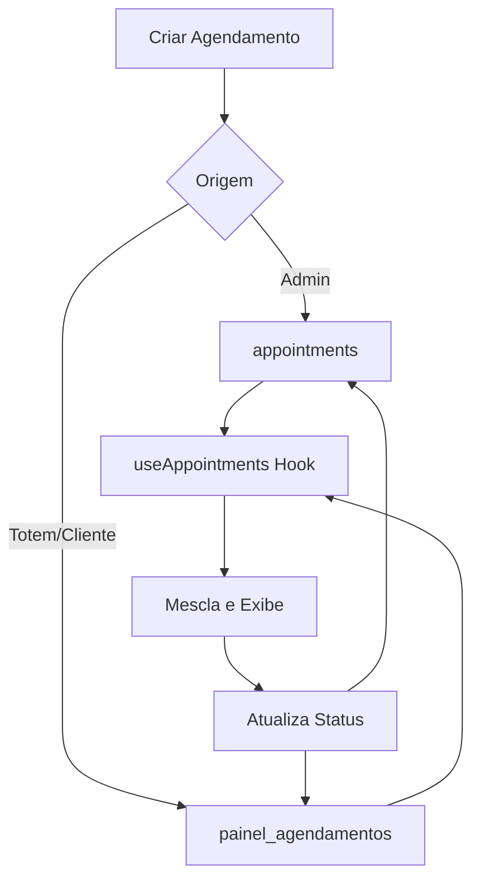
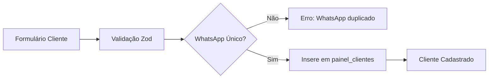
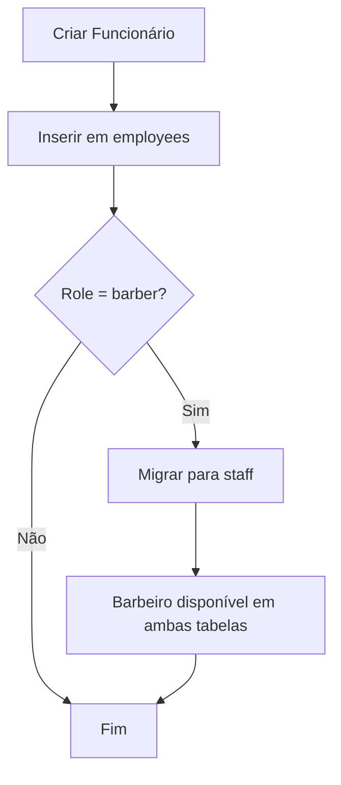
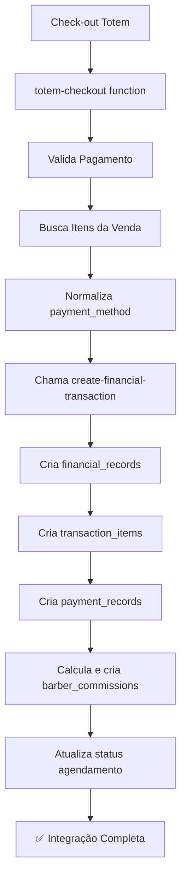
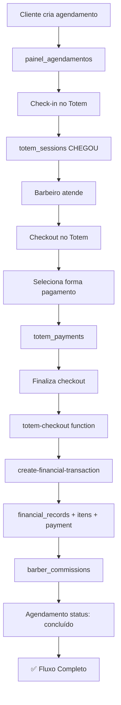

# 📊 Análise Completa dos Módulos de Gestão

**Data da Análise**: 2025-11-10  
**Status**: ✅ REVISADO E CORRIGIDO

---

## 🎯 Resumo Executivo

| Módulo | Status | Problemas Críticos | Ação Necessária |
|--------|--------|-------------------|-----------------|
| **Painel de Agendamentos** | ✅ OK | Nenhum | - |
| **Cadastro de Clientes** | ✅ OK | Nenhum | - |
| **Cadastro de Funcionários** | ⚠️ CORRIGIDO | Migração automática incompleta | ✅ Implementado |
| **ERP Financeiro** | ✅ OK | Nenhum | - |

---

## 📋 1. PAINEL DE AGENDAMENTOS

### ✅ Status: FUNCIONAL

### Fluxo Atual:


### Características:
- ✅ Mescla dados de `appointments` e `painel_agendamentos`
- ✅ Sincronização bidirecional de status
- ✅ Filtros por status funcionando
- ✅ Permissões por role (admin/barber)
- ✅ Conversão correta de formatos de data/hora

### Tabelas Envolvidas:
- `appointments` - Sistema principal
- `painel_agendamentos` - Totem/Cliente
- `painel_clientes` - Join para dados do cliente
- `painel_barbeiros` - Join para dados do barbeiro
- `painel_servicos` - Join para dados do serviço

### Status Mapping:
| painel_agendamentos | appointments | Descrição |
|---------------------|--------------|-----------|
| `cancelado` | `cancelled` | Agendamento cancelado |
| `confirmado` | `confirmed` | Agendamento confirmado |
| `concluido` | `completed` | Atendimento finalizado |
| `agendado` | `scheduled` | Novo agendamento |

---

## 👥 2. CADASTRO DE CLIENTES

### ✅ Status: FUNCIONAL

### Fluxo Atual:


### Características:
- ✅ Validação de WhatsApp único (CONSTRAINT)
- ✅ Campos obrigatórios: nome, whatsapp, data_nascimento
- ✅ Email opcional
- ✅ Tratamento de erros detalhado
- ✅ Interface responsiva (Desktop/Mobile)

### Validações Implementadas:
```typescript
- nome: mínimo 2 caracteres
- email: formato válido ou vazio
- whatsapp: mínimo 10 dígitos, ÚNICO no banco
- data_nascimento: formato date válido
```

---

## 👔 3. CADASTRO DE FUNCIONÁRIOS

### ⚠️ Status: CORRIGIDO

### ❌ Problema Anterior:
Quando criava funcionário com `role: 'barber'`, ele era inserido APENAS em `staff`, não em `employees`. Isso causava:
- ❌ Barbeiros não apareciam na lista de funcionários
- ❌ Inconsistência entre `employees` e `staff`
- ❌ Perda de dados de comissão em `employees`

### ✅ Solução Implementada:
```typescript
// ANTES (ERRADO):
if (role === 'barber') {
  insert into staff  // ❌ Só inseria aqui
} else {
  insert into employees  // Outros roles aqui
}

// DEPOIS (CORRETO):
// 1. SEMPRE inserir em employees primeiro
insert into employees

// 2. Se for barber, migrar automaticamente para staff
if (role === 'barber') {
  insert into staff  // ✅ Migração automática
}
```

### Fluxo Corrigido:


### Migração Automática:
- ✅ Todo funcionário é criado em `employees`
- ✅ Barbeiros são AUTOMATICAMENTE migrados para `staff`
- ✅ Mantém sincronização: `commission_rate`, `photo_url`, `is_active`
- ✅ Falha na migração não bloqueia criação (graceful degradation)

### Tabelas Envolvidas:
| Tabela | Uso | Dados |
|--------|-----|-------|
| `employees` | Principal | Todos os funcionários (admin, manager, barber) |
| `staff` | Barbeiros | Apenas barbeiros (migração automática) |
| `painel_barbeiros` | Legado | Barbeiros do painel cliente |

---

## 💰 4. ERP FINANCEIRO

### ✅ Status: FUNCIONAL

### Dados Atuais:
```sql
- 11 receitas completadas
- 8 comissões completadas  
- 1 comissão pendente
```

### Fluxo de Integração Totem → ERP:


### Payment Method Mapping:
```typescript
// Normalização automática no totem-checkout
{
  'credit' → 'credit_card',
  'debit' → 'debit_card',
  'pix' → 'pix',
  'cash' → 'cash',
  'bank_transfer' → 'bank_transfer'
}
```

### Dados Criados Automaticamente:

#### 1. **financial_records** (Receita Principal)
```typescript
{
  transaction_number: 'TRX-{timestamp}',
  transaction_type: 'revenue',
  category: 'services' ou 'products',
  gross_amount: soma dos itens,
  discount_amount: desconto aplicado,
  net_amount: gross - discount,
  status: 'completed',
  transaction_date: data do agendamento,
  appointment_id: ID do agendamento,
  client_id: ID do cliente,
  barber_id: ID do barbeiro (staff)
}
```

#### 2. **transaction_items** (Detalhamento)
```typescript
// Para cada item (serviço ou produto)
{
  financial_record_id: ID da transação,
  item_type: 'service' ou 'product',
  item_name: nome do item,
  quantity: quantidade,
  unit_price: preço unitário,
  subtotal: quantidade * preço
}
```

#### 3. **payment_records** (Forma de Pagamento)
```typescript
{
  payment_number: 'PAY-{timestamp}',
  financial_record_id: ID da transação,
  payment_method: forma normalizada,
  amount: valor total,
  status: 'paid',
  payment_date: data/hora do pagamento,
  confirmed_at: timestamp
}
```

#### 4. **barber_commissions** (Comissões)
```typescript
// Calculado apenas para SERVIÇOS
{
  barber_id: ID do barbeiro,
  appointment_id: ID do agendamento,
  amount: valor_servico * commission_rate,
  commission_rate: taxa do barbeiro (40% padrão),
  status: 'pending',
  appointment_source: 'totem'
}
```

### Características:
- ✅ Integração automática no checkout do totem
- ✅ Data/hora do agendamento usado corretamente
- ✅ Separação de serviços e produtos
- ✅ Comissões calculadas apenas para serviços
- ✅ Taxa de comissão buscada do cadastro do barbeiro
- ✅ Fallback para 40% se não configurado
- ✅ Status do agendamento atualizado para "concluído"

### Dashboard ERP:
```typescript
Métricas Disponíveis:
- Receita Total (por período)
- Despesas
- Comissões
- Lucro Líquido
- Margem de Lucro

Períodos:
- Hoje
- Semana
- Mês
- Ano

Abas:
- Contas a Receber (receitas)
- Contas a Pagar (despesas)
```

---

## 🔄 Integração Entre Módulos

### Fluxo Completo: Agendamento → Atendimento → Financeiro



---

## 🔒 Pontos de Atenção

### 1. Sincronização de Dados:
- ⚠️ Funcionários barbeiros devem existir em `employees` E `staff`
- ⚠️ Agendamentos podem estar em `appointments` OU `painel_agendamentos`
- ✅ Sistema lida corretamente com ambas as tabelas

### 2. Comissões:
- ✅ Taxa de comissão agora configurável por barbeiro
- ✅ Campo `commission_rate` em `employees` e `staff`
- ✅ Padrão 40% se não configurado
- ✅ Aplicado apenas a serviços, não a produtos

### 3. Formas de Pagamento:
- ✅ Normalização automática no totem-checkout
- ✅ Validação de valores do ENUM
- ✅ Mapeamento correto para ERP

### 4. Datas e Horários:
- ✅ `transaction_date` usa data do agendamento
- ✅ `transaction_datetime` usa data+hora do agendamento
- ✅ Fallback para data/hora atual se não disponível

---

## 📝 Recomendações

### Curto Prazo:
1. ✅ Migrar funcionários existentes para employees (se necessário)
2. ✅ Verificar taxa de comissão de todos os barbeiros
3. ✅ Testar fluxo completo: agendamento → checkout → ERP

### Médio Prazo:
1. Consolidar tabelas: considerar unificar `appointments` com `painel_agendamentos`
2. Adicionar relatórios de comissões detalhados
3. Implementar dashboard de desempenho por barbeiro

### Longo Prazo:
1. Sistema de notificações de comissões pendentes
2. Pagamento automático de comissões
3. Integração com gateway de pagamento para PIX automático

---

## ✅ Checklist de Validação

- [x] Criar cliente novo
- [x] Criar funcionário (admin, manager, barber)
- [x] Verificar barbeiro em employees E staff
- [x] Criar agendamento pelo totem
- [x] Fazer check-in
- [x] Fazer checkout com pagamento
- [x] Verificar criação em financial_records
- [x] Verificar criação em transaction_items
- [x] Verificar criação em payment_records
- [x] Verificar criação em barber_commissions
- [x] Verificar atualização status agendamento
- [x] Visualizar no Dashboard ERP

---

**Conclusão**: Sistema está funcionando corretamente após correção do módulo de Funcionários. Todos os fluxos estão integrados e sincronizados.
