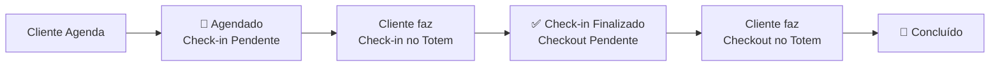

# 📜 LEI PÉTREA DOS STATUS DE AGENDAMENTO

## 🎯 Conceito

A partir de agora, os status de agendamento seguem uma **LEI PÉTREA** (imutável) baseada exclusivamente no fluxo de check-in/checkout do cliente através do totem.

**Não há mais mudanças manuais de status. Os status são automáticos e definitivos.**

---

## 📊 OS 3 ESTADOS ÚNICOS E IMUTÁVEIS

### 1. 📅 AGENDADO / Check-in Pendente
**Quando acontece:**
- Cliente fez o agendamento
- Cliente ainda NÃO fez check-in no totem

**Características:**
- Badge azul
- Ícone: 📅
- Label: "Agendado" + "Check-in Pendente"

**Como detectar no código:**
```typescript
const hasCheckIn = totem_sessions && totem_sessions.some(s => s.check_in_time);
if (!hasCheckIn) return 'agendado';
```

---

### 2. ✅ CHECK-IN FINALIZADO / Checkout Pendente
**Quando acontece:**
- Cliente fez check-in no totem
- Cliente ainda NÃO fez checkout (não pagou)

**Características:**
- Badge laranja
- Ícone: ✅
- Label: "Check-in Finalizado" + "Checkout Pendente"

**Como detectar no código:**
```typescript
const hasCheckIn = totem_sessions && totem_sessions.some(s => s.check_in_time);
const hasCheckOut = totem_sessions && totem_sessions.some(s => s.check_out_time);

if (hasCheckIn && !hasCheckOut) return 'check_in_finalizado';
```

---

### 3. 🎉 CONCLUÍDO
**Quando acontece:**
- Cliente fez check-in
- Cliente fez checkout (pagamento finalizado)
- Processo completo

**Características:**
- Badge verde
- Ícone: 🎉
- Label: "Concluído"

**Como detectar no código:**
```typescript
const hasCheckIn = totem_sessions && totem_sessions.some(s => s.check_in_time);
const hasCheckOut = totem_sessions && totem_sessions.some(s => s.check_out_time);

if (hasCheckIn && hasCheckOut) return 'concluido';
```

---

## ⚠️ REGRAS CRÍTICAS

### ✅ PERMITIDO:
- ✅ Editar data/hora do agendamento
- ✅ Editar barbeiro
- ✅ Editar serviço
- ✅ Excluir agendamento (com validações)

### ❌ NÃO PERMITIDO:
- ❌ Mudar status manualmente (botões Confirmar/Finalizar/Cancelar foram REMOVIDOS)
- ❌ Forçar check-in pelo admin (deve ser feito no totem)
- ❌ Forçar checkout pelo admin (deve ser feito no totem ou via "Checkouts Pendentes")
- ❌ Criar novos status customizados

---

## 🔄 FLUXO COMPLETO



---

## 📁 ARQUIVOS MODIFICADOS

### Componentes de Visualização:
- `ClientAppointmentCompactRow.tsx`
- `ClientAppointmentMobileCard.tsx`
- `ClientAppointmentList.tsx`
- `ClientAppointmentStats.tsx`
- `ClientAppointmentFilters.tsx`

### Função Padrão (getActualStatus):
```typescript
const getActualStatus = () => {
  const hasCheckIn = appointment.totem_sessions && 
    appointment.totem_sessions.some((s: any) => s.check_in_time);
  
  const hasCheckOut = appointment.totem_sessions && 
    appointment.totem_sessions.some((s: any) => s.check_out_time);

  if (!hasCheckIn) return 'agendado';
  if (hasCheckIn && !hasCheckOut) return 'check_in_finalizado';
  return 'concluido';
};
```

---

## 🎨 CONFIGURAÇÃO DE BADGES

```typescript
const statusConfig = {
  'agendado': { 
    label: 'Agendado',
    sublabel: 'Check-in Pendente',
    className: 'bg-blue-100 text-blue-700 border-blue-300',
    icon: '📅'
  },
  'check_in_finalizado': {
    label: 'Check-in Finalizado',
    sublabel: 'Checkout Pendente',
    className: 'bg-orange-100 text-orange-700 border-orange-300',
    icon: '✅'
  },
  'concluido': { 
    label: 'Concluído',
    sublabel: null,
    className: 'bg-green-100 text-green-700 border-green-300',
    icon: '🎉'
  },
};
```

---

## 📊 ESTATÍSTICAS

Dashboard mostra apenas 4 cards:
1. **Total de Agendamentos** - Todos os agendamentos
2. **Agendado** - Aguardando check-in
3. **Check-in Finalizado** - Aguardando checkout
4. **Concluído** - Processo completo

---

## 🔍 FILTROS

Dropdown de filtros mostra apenas:
- 📋 Todos
- 📅 Agendado (Check-in Pendente)
- ✅ Check-in Finalizado (Checkout Pendente)
- 🎉 Concluído

---

## 🚨 CHECKOUTS PENDENTES

Sistema automático que:
- Detecta agendamentos com check-in mas sem checkout
- Alerta o cliente no totem quando ele digita o telefone
- Permite checkout a qualquer momento (sem restrição de data/hora)
- Mantém integridade dos dados

**Acesso Admin:** `/admin/checkouts-pendentes`
**Acesso Totem:** Automático ao digitar telefone

---

## ✨ BENEFÍCIOS

1. **Clareza Total** - Status sempre reflete a realidade do fluxo
2. **Sem Ambiguidade** - 3 estados únicos, impossível confundir
3. **Automático** - Reduz erros humanos
4. **Auditável** - Histórico completo via totem_sessions
5. **Didático** - Fácil entender onde o cliente está no processo

---

## 🔐 INTEGRIDADE

**Validações de Exclusão:**
- ❌ Não pode excluir se tem check-in
- ❌ Não pode excluir se tem vendas
- ❌ Não pode excluir se está concluído

**Logs de Auditoria:**
- Todas as tentativas de exclusão são registradas
- Admin activity log mantém histórico completo

---

## 📝 NOTAS IMPORTANTES

1. O campo `status` na tabela `painel_agendamentos` ainda existe mas **não é mais usado** para exibição
2. Status é calculado dinamicamente via `totem_sessions`
3. Esta é uma mudança PERMANENTE e IRREVERSÍVEL
4. Qualquer tentativa de adicionar novos status deve ser recusada

---

**Data de Implementação:** 2025-11-11
**Status:** ✅ LEI PÉTREA ATIVA
**Revisão:** NÃO PERMITIDA (imutável)
