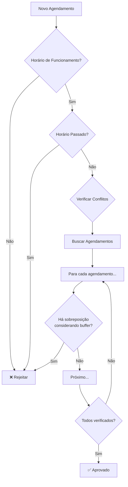

# Lógica de Agendamento - Sistema Robusto

## 📋 Visão Geral

Sistema inteligente de agendamento com **buffer automático de 10 minutos** entre serviços, garantindo tempo adequado para preparação e limpeza entre atendimentos.

## ⏰ Regras do Sistema

### 1. Buffer Entre Agendamentos
- **10 minutos obrigatórios** entre um serviço e outro
- Exemplo prático:
  ```
  Agendamento 1: 09:00 - Barba (20 min)
  ├─ Serviço: 09:00 → 09:20
  └─ Buffer: 09:20 → 09:30
  
  Próximo horário disponível: 09:30
  ```

### 2. Horário de Funcionamento
- **Abertura:** 09:00
- **Fechamento:** 20:00
- Validação: O serviço precisa **terminar antes** das 20:00 (sem considerar o buffer)

### 3. Slots de Tempo
- **Intervalos:** 30 minutos (09:00, 09:30, 10:00...)
- **Antecedência mínima:** 30 minutos para agendamentos no dia atual

## 🔧 Implementação Técnica

### Arquivos Principais

#### 1. `src/lib/utils/timeCalculations.ts`
Utilitários centralizados para cálculos de tempo:

```typescript
// Constantes do sistema
const BUFFER_MINUTES = 10;
const BUSINESS_START_HOUR = 9;
const BUSINESS_END_HOUR = 20;

// Calcular término com buffer
calculateEndTimeWithBuffer("09:00", 20) 
// => "09:30" (20min serviço + 10min buffer)

// Verificar sobreposição (com buffer)
hasTimeOverlap("09:00", 20, "09:25", 30)
// => true (há conflito)

hasTimeOverlap("09:00", 20, "09:30", 30)
// => false (sem conflito)
```

#### 2. `src/hooks/useAppointmentValidation.ts`
Hook de validação usado por todos os pontos de entrada:

- ✅ **Painel do Cliente** (`/painel-cliente/agendar`)
- ✅ **Totem Digital** (`/totem`)
- ✅ **Painel Administrador** (`/admin/agendamentos`)

### Fluxo de Validação



## 📊 Exemplos Práticos

### Exemplo 1: Agendamento Simples
```
Horário: 09:00
Serviço: Barba (20 min)
Preço: R$ 15,00

Cálculo:
├─ Início: 09:00
├─ Término serviço: 09:20
├─ Buffer: +10 min
└─ Próximo disponível: 09:30

✅ Slot ocupado: 09:00
✅ Slot ocupado: 09:30 (parcialmente, devido ao buffer)
```

### Exemplo 2: Múltiplos Agendamentos
```
1️⃣ Barba às 09:00 (20 min)
   └─ Ocupa: 09:00 até 09:30 (com buffer)

2️⃣ Corte às 09:30 (30 min)
   └─ Ocupa: 09:30 até 10:10 (com buffer)

3️⃣ Corte + Barba às 10:10 (60 min)
   └─ Ocupa: 10:10 até 11:20 (com buffer)

Resultado: 3 agendamentos otimizados
```

### Exemplo 3: Validação de Conflito
```
❌ CONFLITO DETECTADO

Existente: 09:00 - Barba (20 min)
├─ Serviço: 09:00 → 09:20
└─ Buffer: 09:20 → 09:30

Tentativa: 09:20 - Corte (30 min)
└─ ❌ Conflito! (invade o buffer do agendamento anterior)

✅ Sugestão: Próximo horário disponível: 09:30
```

## 🎯 Validações Implementadas

### 1. `checkBusinessHours(time, duration)`
Verifica se o serviço pode ser concluído dentro do expediente:
```typescript
checkBusinessHours("19:30", 60)
// => false (termina às 20:30, após fechamento)

checkBusinessHours("19:00", 60)
// => true (termina exatamente às 20:00)
```

### 2. `checkAppointmentConflict(barberId, date, time, duration)`
Verifica conflitos considerando o buffer:
```typescript
// Agendamento existente: 09:00 (20 min)
checkAppointmentConflict(barberId, date, "09:25", 30)
// => false (conflita com buffer)

checkAppointmentConflict(barberId, date, "09:30", 30)
// => true (sem conflito)
```

### 3. `getAvailableTimeSlots(barberId, date, duration)`
Retorna todos os horários disponíveis:
```typescript
getAvailableTimeSlots(barberId, date, 20)
// => [
//   { time: "09:00", available: true },
//   { time: "09:30", available: false, reason: "Horário ocupado" },
//   { time: "10:00", available: true },
//   ...
// ]
```

## 🔄 Pontos de Entrada

### 1. Painel do Cliente
**Arquivo:** `src/components/client/appointment/useClientFormSubmit.ts`

```typescript
import { useAppointmentValidation } from '@/hooks/useAppointmentValidation';

const { validateAppointment } = useAppointmentValidation();

// Antes de criar o agendamento
const validation = await validateAppointment(
  barberId,
  selectedDate,
  selectedTime,
  serviceDuration
);

if (!validation.valid) {
  toast.error(validation.error);
  return;
}

// Criar agendamento...
```

### 2. Totem Digital
**Arquivo:** `src/pages/Totem/TotemDataHora.tsx`

Usa as mesmas validações via `useAppointmentValidation`:
```typescript
const { validateAppointment, getAvailableTimeSlots } = useAppointmentValidation();

// Buscar slots disponíveis
const slots = await getAvailableTimeSlots(barberId, date, serviceDuration);

// Validar antes de confirmar
const validation = await validateAppointment(...);
```

### 3. Painel Administrador
**Arquivo:** `src/components/admin/appointments/form/useAppointmentFormSubmit.ts`

```typescript
import { useAppointmentValidation } from '@/hooks/useAppointmentValidation';

const { validateAppointment } = useAppointmentValidation();

// Validação antes de salvar
const validation = await validateAppointment(
  data.staff_id,
  data.date,
  data.time,
  selectedService.duration,
  appointmentId // excluir o próprio agendamento ao editar
);
```

## 📈 Benefícios do Sistema

### 1. Consistência
- ✅ Mesma lógica em todos os pontos de entrada
- ✅ Validação centralizada
- ✅ Fácil manutenção

### 2. Flexibilidade
- ✅ Buffer configurável (constante `BUFFER_MINUTES`)
- ✅ Horário de funcionamento configurável
- ✅ Intervalos de slot configuráveis

### 3. Robustez
- ✅ Previne duplos agendamentos
- ✅ Considera tempo de preparação
- ✅ Validação antes de salvar no banco
- ✅ Mensagens de erro claras

### 4. Otimização
- ✅ Máximo aproveitamento do tempo
- ✅ Sugere próximo horário disponível
- ✅ Calcula automaticamente slots ocupados

## 🚀 Como Testar

### Teste 1: Buffer Funcionando
1. Criar agendamento: 09:00 - Barba (20 min)
2. Tentar agendar: 09:20 - qualquer serviço
3. **Resultado esperado:** ❌ Conflito detectado, sugestão: 09:30

### Teste 2: Múltiplos Agendamentos
1. Criar: 09:00 - Barba (20 min)
2. Criar: 09:30 - Corte (30 min)
3. Criar: 10:10 - Corte + Barba (60 min)
4. **Resultado esperado:** ✅ Todos aceitos sem conflito

### Teste 3: Limite de Horário
1. Tentar agendar: 19:30 - Corte (60 min)
2. **Resultado esperado:** ❌ Serviço termina após fechamento

## 🔧 Configuração

Para ajustar as configurações, edite `src/lib/utils/timeCalculations.ts`:

```typescript
// Aumentar buffer para 15 minutos
export const BUFFER_MINUTES = 15;

// Alterar horário de funcionamento
export const BUSINESS_START_HOUR = 8;
export const BUSINESS_END_HOUR = 22;

// Alterar intervalo de slots
export const SLOT_INTERVAL_MINUTES = 15; // slots a cada 15 min
```

## 📝 Notas Importantes

1. **Buffer é obrigatório:** Não pode ser desabilitado, apenas ajustado
2. **Validação no backend:** Implementar as mesmas regras nos Edge Functions
3. **Timezone:** Sistema usa timezone local do navegador
4. **Cancelamentos:** Não liberam o buffer automaticamente (design intencional)

---

**Última atualização:** 2025-11-13
**Versão do sistema:** 2.0 (com buffer inteligente)
