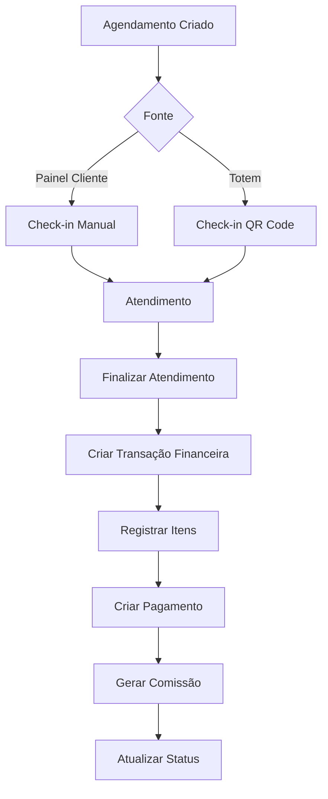

# 💼 Módulo Financeiro ERP - Documentação Completa

## 📋 Visão Geral

O Módulo Financeiro ERP é um sistema completo de gestão financeira que integra TODAS as transações da barbearia, desde agendamentos até vendas de produtos, com rastreamento completo e padronizado.

## 🎯 Características Principais

### 1. Sistema de IDs Únicos

Cada transação possui **IDs únicos** padronizados:

- **Transação Financeira**: `TRX-YYYYMMDD-XXXXXX`
  - Exemplo: `TRX-20231107-123456`

- **Pagamento**: `PAY-YYYYMMDD-XXXXXX`
  - Exemplo: `PAY-20231107-789012`

### 2. Status Padronizados

#### Status de Transação
- `pending` - Pendente
- `processing` - Processando
- `completed` - Concluído
- `cancelled` - Cancelado
- `failed` - Falhou

#### Status de Pagamento
- `pending` - Aguardando pagamento
- `processing` - Processando
- `paid` - Pago
- `partially_paid` - Parcialmente pago
- `refunded` - Reembolsado
- `cancelled` - Cancelado

#### Métodos de Pagamento
- `cash` - Dinheiro
- `credit_card` - Cartão de crédito
- `debit_card` - Cartão de débito
- `pix` - PIX
- `bank_transfer` - Transferência bancária

#### Tipos de Transação
- `revenue` - Receita
- `expense` - Despesa
- `commission` - Comissão
- `refund` - Reembolso
- `adjustment` - Ajuste

### 3. Estrutura de Dados

#### Tabela: `financial_records`
Registro principal de todas as transações financeiras.

```sql
- id: UUID único
- transaction_number: Número único da transação
- transaction_type: Tipo (revenue, expense, commission, etc)
- category: Categoria principal
- subcategory: Subcategoria
- gross_amount: Valor bruto
- discount_amount: Valor de desconto
- tax_amount: Valor de impostos
- net_amount: Valor líquido
- status: Status da transação
- description: Descrição
- notes: Observações
- transaction_date: Data da transação
- completed_at: Data de conclusão
- appointment_id: Referência ao agendamento
- client_id: Referência ao cliente
- barber_id: Referência ao barbeiro
- metadata: Metadados JSON
```

#### Tabela: `transaction_items`
Itens detalhados de cada transação (serviços + produtos).

```sql
- id: UUID único
- financial_record_id: Referência ao registro financeiro
- item_type: Tipo (service, product, extra)
- item_id: ID do item
- item_name: Nome do item
- quantity: Quantidade
- unit_price: Preço unitário
- discount: Desconto
- subtotal: Subtotal
```

#### Tabela: `payment_records`
Registros de pagamentos vinculados às transações.

```sql
- id: UUID único
- payment_number: Número único do pagamento
- financial_record_id: Referência ao registro financeiro
- payment_method: Método de pagamento
- amount: Valor
- status: Status do pagamento
- transaction_id: ID externo (PIX, cartão, etc)
- pix_qr_code: QR Code PIX
- payment_date: Data do pagamento
```

## 🔄 Fluxo de Integração

### Agendamento → Finalização → Financeiro



### 1. Cliente Agenda
- **Painel do Cliente** ou **Totem**
- Status inicial: `agendado`
- Gera ID único do agendamento

### 2. Check-in
- Cliente faz check-in no totem
- Status: `em_atendimento`
- Registra horário de entrada

### 3. Atendimento
- Barbeiro atende o cliente
- Pode adicionar **serviços extras**
- Pode adicionar **produtos**

### 4. Checkout/Finalização
- **Totem**: Cliente finaliza no totem
- **Admin**: Admin clica em "Finalizar Atendimento"

### 5. Transação Financeira (Automática)

Ao finalizar, o sistema **automaticamente**:

#### 5.1. Cria Registro Financeiro
```javascript
{
  transaction_number: "TRX-20231107-123456",
  transaction_type: "revenue",
  category: "service",
  gross_amount: 100.00,
  discount_amount: 10.00,
  net_amount: 90.00,
  status: "completed"
}
```

#### 5.2. Registra Itens
```javascript
[
  {
    item_type: "service",
    item_name: "Corte + Barba",
    quantity: 1,
    unit_price: 80.00,
    subtotal: 80.00
  },
  {
    item_type: "product",
    item_name: "Pomada Modeladora",
    quantity: 1,
    unit_price: 20.00,
    subtotal: 20.00
  }
]
```

#### 5.3. Cria Registro de Pagamento
```javascript
{
  payment_number: "PAY-20231107-789012",
  payment_method: "pix",
  amount: 90.00,
  status: "paid"
}
```

#### 5.4. Gera Comissão do Barbeiro
```javascript
{
  transaction_type: "commission",
  category: "barber_commission",
  net_amount: 45.00, // 50% de comissão
  status: "pending"
}
```

#### 5.5. Atualiza Estoque (se produto)
- Decrementa quantidade do produto vendido

## 📊 Dashboard ERP

### Métricas em Tempo Real

- **Receita Total**: Soma de todas as receitas
- **Despesas**: Soma de todas as despesas
- **Comissões**: Total de comissões geradas
- **Lucro Líquido**: Receita - Despesas - Comissões
- **Margem de Lucro**: % de lucro sobre receita

### Relatórios

- **Por Período**: Hoje, Semana, Mês, Ano
- **Por Barbeiro**: Comissões individuais
- **Por Categoria**: Serviços vs Produtos
- **Por Método de Pagamento**: PIX, Cartão, Dinheiro

## 🔧 API - Edge Functions

### 1. `create-financial-transaction`

Cria uma transação financeira completa.

**Input:**
```javascript
{
  appointment_id: "uuid",
  client_id: "uuid",
  barber_id: "uuid",
  items: [
    {
      type: "service" | "product",
      id: "uuid",
      name: "string",
      quantity: number,
      price: number,
      discount: number
    }
  ],
  payment_method: "pix" | "cash" | "credit_card",
  discount_amount: number,
  notes: "string"
}
```

**Output:**
```javascript
{
  success: true,
  data: {
    financial_record_id: "uuid",
    transaction_number: "TRX-20231107-123456",
    payment_number: "PAY-20231107-789012",
    gross_amount: 100.00,
    net_amount: 90.00,
    status: "completed"
  }
}
```

### 2. `process-appointment-completion`

Finaliza um agendamento e cria todas as transações.

**Input:**
```javascript
{
  agendamento_id: "uuid",
  source: "painel" | "totem",
  completed_by: "uuid"
}
```

## 💡 Benefícios

### 1. Rastreabilidade Total
- Todo valor tem origem clara
- Auditoria completa de transações
- Histórico detalhado

### 2. Integração Automática
- Agendamento → Financeiro (automático)
- Produtos → Financeiro (automático)
- Comissões → Financeiro (automático)

### 3. Relatórios Precisos
- Dados sempre atualizados
- Métricas em tempo real
- Análises detalhadas

### 4. Gestão de Comissões
- Cálculo automático
- Rastreamento por barbeiro
- Status de pagamento

### 5. Controle de Estoque
- Atualização automática ao vender
- Integrado com vendas
- Alertas de estoque baixo

## 🚀 Como Usar

### Admin: Finalizar Atendimento Manualmente

1. Vá para **Admin → Agendamentos**
2. Localize o agendamento **Em Atendimento**
3. Clique em **"Finalizar Atendimento"**
4. Sistema cria automaticamente:
   - Registro financeiro
   - Itens da transação
   - Pagamento
   - Comissão

### Totem: Finalização Automática

1. Cliente faz check-in
2. Barbeiro atende
3. Cliente vai ao checkout
4. Seleciona forma de pagamento
5. Finaliza
6. Sistema cria tudo automaticamente

### Adicionar Produtos no Atendimento

1. Durante o checkout
2. Selecionar produtos
3. Produtos são incluídos na transação
4. Estoque é atualizado automaticamente

## 📈 Próximas Funcionalidades

- [ ] Conciliação bancária
- [ ] Integração com gateway de pagamento
- [ ] Exportação de relatórios (PDF, Excel)
- [ ] Gráficos avançados
- [ ] Previsão de fluxo de caixa
- [ ] Análise de tendências
- [ ] Multi-moeda
- [ ] Controle de impostos

## 🔐 Segurança

- RLS habilitado em todas as tabelas
- Apenas admins podem gerenciar
- Barbeiros veem apenas suas comissões
- Logs de auditoria completos
